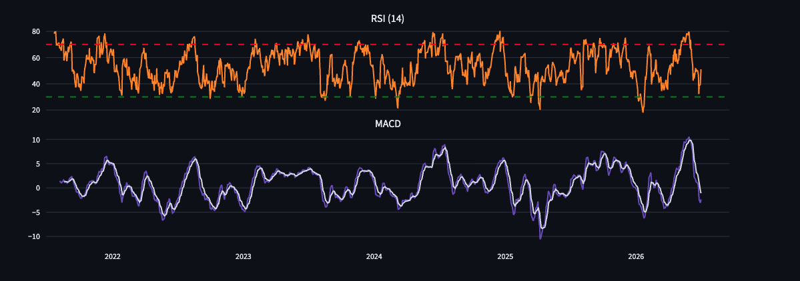
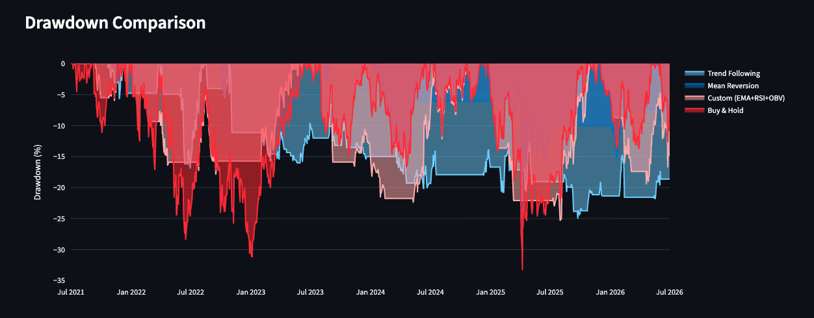
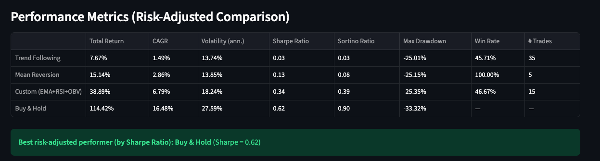
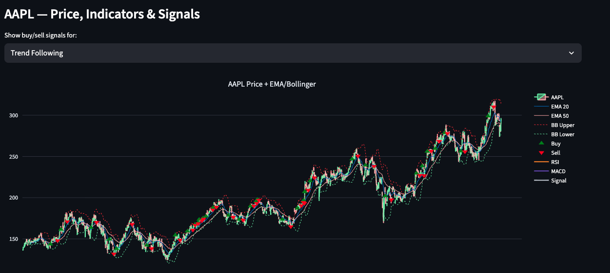

#FINM-25000-Homework-2


A small trading terminal built on Alpaca's Market Data API. It pulls historical OHLCV bars, polls live bid/ask quotes, and displays everything in a Streamlit UI. Built for FINM-25000 Homework 1.


 HW2: Technical Indicators & Strategy Backtesting

Built on top of the HW1 connector, this adds a full backtesting platform:

| File | Purpose |
|---|---|
| `data_loader.py` | Pulls 5+ years of daily OHLCV bars for a chosen ticker from Alpaca |
| `indicators.py` | 8 indicators: SMA, EMA, MACD, ADX (trend) · RSI (momentum) · Bollinger Bands, ATR (volatility) · OBV (volume) |
| `strategies.py` | Strategy 1 (Trend Following: MACD+ADX), Strategy 2 (Mean Reversion: RSI+Bollinger), Strategy 3 (Custom: EMA cross + RSI filter + OBV volume confirmation) - more on the strategy 3 is in the description in strategies.py |
| `backtest.py` | Long-only, no-leverage `Backtester` engine. $100k initial capital, lookahead-safe (signals lag one day), optional commission, trade log, buy & hold benchmark |
| `metrics.py` | Total Return, CAGR, annualized Volatility, Sharpe, Sortino, Max Drawdown, Win Rate |
| `backtest_app.py` | Streamlit dashboard: price/indicator chart with buy/sell markers, equity curve comparison, drawdown comparison, metrics table |
| `test_backtesting.py` | Unit tests against synthetic OHLCV data (no Alpaca credentials needed) |

Run the dashboard:

```
poetry run streamlit run backtest_app.py
```

Run the tests:

```
poetry run pytest test_backtesting.py -v
```

## Charts










## Final Report (PDF)

The final report is `report.pdf` in the repo root. It contains the strategy descriptions, entry/exit rules, the performance comparison table (Buy & Hold vs all three strategies), the equity curve, drawdown, and price/signal charts, and a discussion of results.

It's generated by `generate_report.py`, which runs a live backtest and writes the PDF. To regenerate it for a different ticker, pass `--symbol`:

​```
poetry run python generate_report.py --symbol MSFT --years 5
​```

Other options:
- `--symbol` — ticker to analyze (default AAPL). Examples: AAPL, MSFT, SPY, QQQ, NVDA
- `--years` — years of daily history (default 5)
- `--capital` — initial capital (default 100000)
- `--commission_bps` — commission per trade in basis points (default 0)
- `--out` — output filename (default report.pdf)

Requires your Alpaca keys in `.env`, since it pulls fresh data from Alpaca.

**Design notes**
- No lookahead bias: a strategy's signal for day T is only acted on starting day T+1 inside `Backtester.run()`.
- Long-only / no leverage: position is always 0 or 1 (fully in cash or fully invested); no shorting, no margin.
- The custom strategy deliberately spans three indicator categories (trend, momentum, volume) rather than stacking two indicators from the same category.
- The dashboard surfaces the best strategy by **Sharpe Ratio** (risk-adjusted), not raw return.


